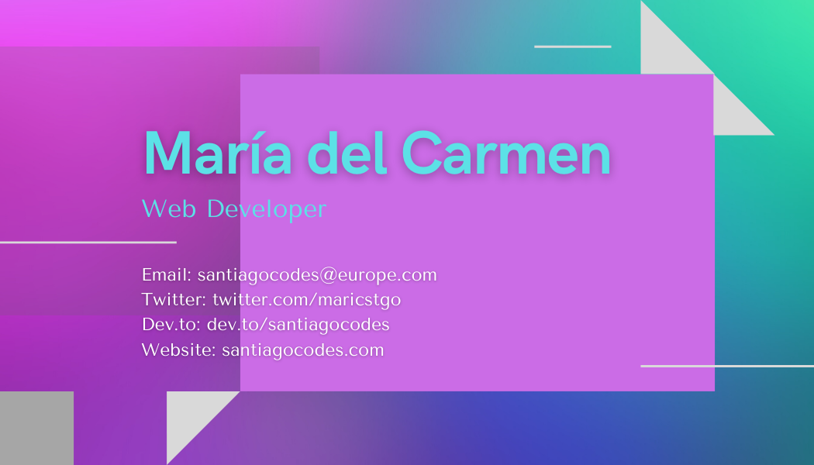

<!--
**santiagocodes/santiagocodes** is a ✨ _special_ ✨ repository because its `README.md` (this file) appears on your GitHub profile.
# Maria del Carmen Santiago Betancourt - aka [santiagocodes](https://santiagocodes.com/)

Here are some ideas to get you started:

- 🔭 I’m currently working on ...
- 🌱 I’m currently learning ...
- 👯 I’m looking to collaborate on ...
- 🤔 I’m looking for help with ...
- 💬 Ask me about ...
- 📫 How to reach me: ...
- 😄 Pronouns: ...
- ⚡ Fun fact: ...

Icons: https://gist.github.com/rxaviers/7360908
Logo Icons: https://icon-icons.com/
-->

## Dev Profile

Hi there :wave: I am a web developer based in Madrid. You can usually find me working on front end projects, but I occasionally delve into back end (just to keep things interesting :wink:). When I'm not coding and solving challenges I am writing articles and tutorials for the [DEV](https://dev.to/santiagocodes) community.

## Languages and Tools

           

## My Values

:coffee: Coffee is a healthy addiction.  
:books: There is always something new to learn.  
:ear: Communication is key. Hear people out.  
:musical_note: Music can do wonders for the soul.  
:earth_africa: Explore and take care of our precious planet.  
:roller_coaster: Life is a roller coster. Enjoy the ride!

<!-- ## How I Work

When working in a team I find that communication, setting priorities and having a timeline from the start is one of the best ways to collaborate. I enjoy working with others and will adapt to any situation/work environment with ease. Just talk to me :relaxed: -->

## Get in Touch

 
 
 

<!--  -->

<!--  Twitter: [https://twitter.com/maricstgo](https://twitter.com/maricstgo)  
 Dev.to: [https://dev.to/santiagocodes](https://dev.to/santiagocodes)  
 LinkedIn: [https://www.linkedin.com/in/mc-santiago/](https://www.linkedin.com/in/mc-santiago/)  
-->
